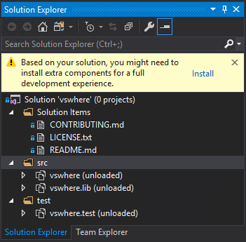
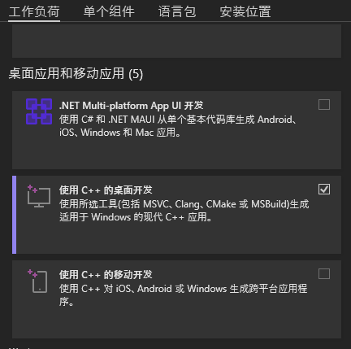
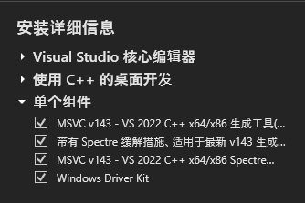
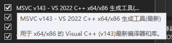
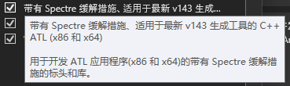
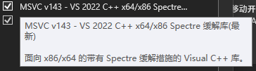

# sample monitor

## 介绍
PC和移动设备投屏软件

## 运行环境配置
### 驱动程序(IndirectDisplay)
> 使用版本大于17的VS打开解决方案(./server/IndirectDisplay/IddsampleDriver.sln)。
> 请安装以下所有
1. OS:win11(22h2)
2. 组件:项目中添加了vsconfig，在使用vs打开解决方案后，如果工具组件有缺失可以按照VS的提示来自动安装组件，如果没有提示则需要手动检查以下组件的安装情况，确保组件已经正确安装
	- VS提示示例如下
   
       
	- 工作负荷勾选`C++桌面开发` 
       
       
    - 单个组件勾选`最新V143带spectra的生成工具`和对应的缓解库

      
      - 这些组件分别是：
      1. 
      2. 
      3. 
3. SDK:10.0.22621 https://developer.microsoft.com/en-us/windows/downloads/windows-sdk/
4. WDK:10.0.22621.382 https://go.microsoft.com/fwlink/?linkid=2196230
	- 在安装sdk和wdk时，可以修改安装位置，其余的点下一步即可

## 使用说明
### IddSampleDriver 使用说明
#### 1. 生成驱动程序
> 在安装好上述环境后进行如下操作可以生成驱动和安装挂载程序

1. 使用版本大于17的VS打开`./server/IndirectDisplay/IddSampleDriver.sln`
2. 对于项目`IddSampleDriver`，项目属性->C/C++->代码生成->运行库=多线程
3. 对于项目`IddSampleApp`,项目属性->C/C++->代码生成->运行库=多线程调试
4. 两个项目的SDK都应设置为10.22621（如果有未知变量的报错，大概率是这个问题）项目属性->常规->SDK=10.22621或者10.0（最新安装的版本）
	— 如果使用的系统不是win11(22h2)，请检查SDK和WDK版本号一致即可
5. 当生成解决方案的时候，遇见error MSB4018: “SignTask”任务意外失败；
   	— 此时你需要做的是在项目`IddSampleDriver`中，项目属性->Driver Signing->Sign mode->Off；
   	— 原因：微软对于驱动程序项目的发行是有要求的，需要获得驱动签名，将其关闭便可以在最后生成的时候，生成一个未获得许可的驱动程序。
6. 右键点击`解决方案`，点击`生成解决方案`；如果在检查4.无误之后，还仍有许多未知变量的报错，请不要着急卸载或重现安装SDK/WDK：
    	— 请你重新启动电脑并确保电脑真正运载SDK/WDK，一般情况下，这个报错会解决。
7. 重新生成解决方案，在`./x64/debug`下以管理员身份运行`IddSampleApp.exe`，可以挂载、卸载驱动以及录制10秒的测试视频

**如果在生成过程中遭遇问题，请发issue**
#### 2. 加载驱动程序
> 建议使用虚拟机，实测win10(22h2)和win11(22h2)可以正常加载驱动

1. 在虚拟机中准备好相关文件并解压(release中driver.rar)
2. 禁用驱动程序强制签名
	- 重启虚拟机，在开始菜单按住`shift`点`重启`
	- 在显示的界面中选择`疑难解答`->`启动设置`->`重启`
	- 按`F7`或者`数字键7`禁用驱动程序强制签名
3. 管理员身份运行`./driver/IddSampleApp.exe`
4. 查看`显示设置`，如果这时没有多显示器选项，说明驱动没有安装，需要手动更新驱动程序
	- 打开设备管理器，这时应该能在`其他设备`中找到`IddSampleDriver`
	- 右键`IddSampleDriver`，点击`更新驱动程序`
	- 在弹出的窗口中选择`选择本地驱动程序`，之后选择`driver`文件夹，勾选`包含子文件夹`选项
5. 如果这时`显示设置`中没有多显示器选项，重新运行`IddSampleApp.exe`
- 注意：可能在加载驱动后鼠标指针无法正常显示，这时可以按`alt`+`tab`切换到控制台窗口，按`x`关闭虚拟显示器
- 建议：这时可以创建一个虚拟机快照以便恢复到当前状态，之后不需要每次都操作禁用驱动程序强制签名
- 如果鼠标指针不能正常显示，建议在物理机通过to desk或向日葵控制虚拟机
	
	

